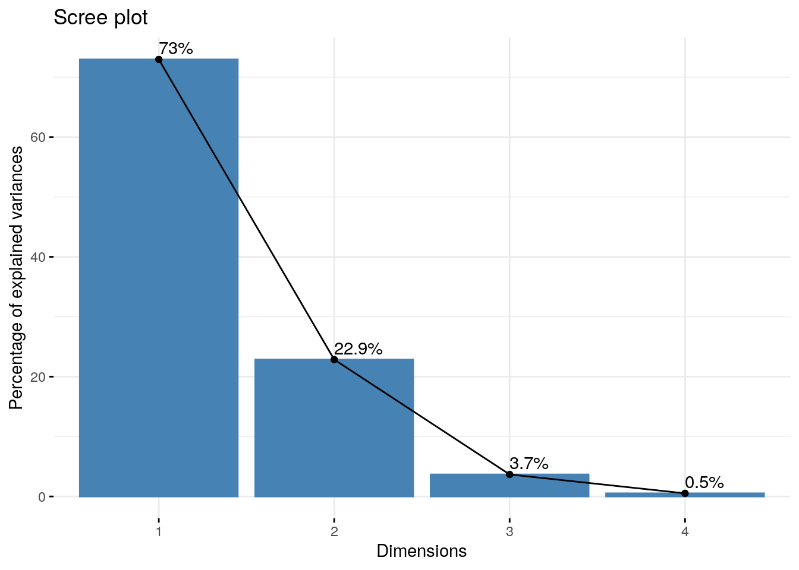
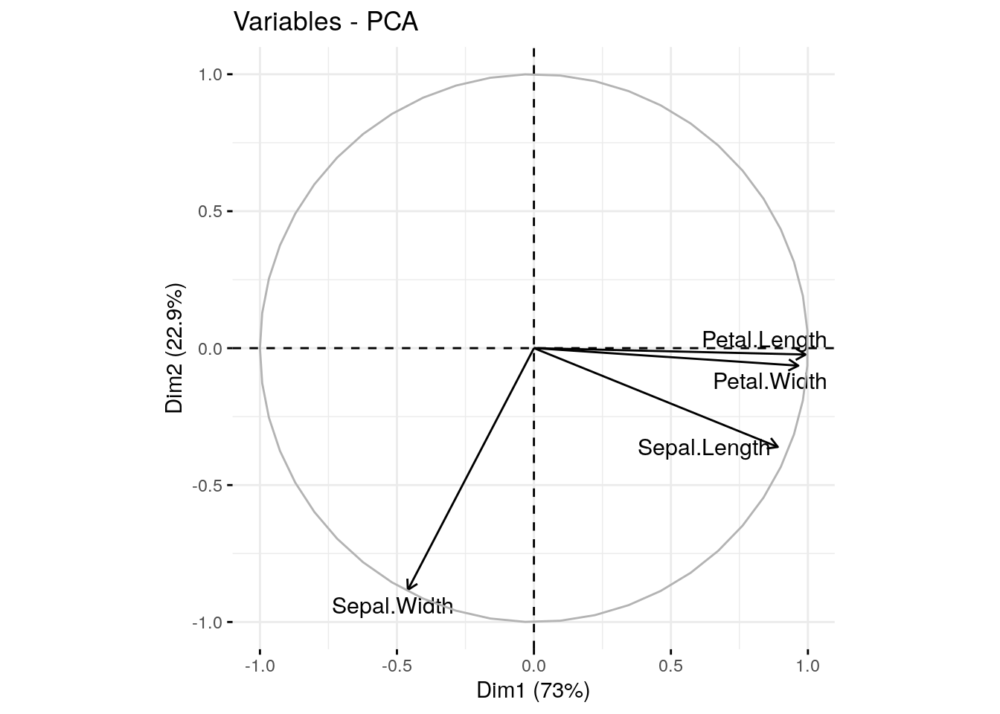
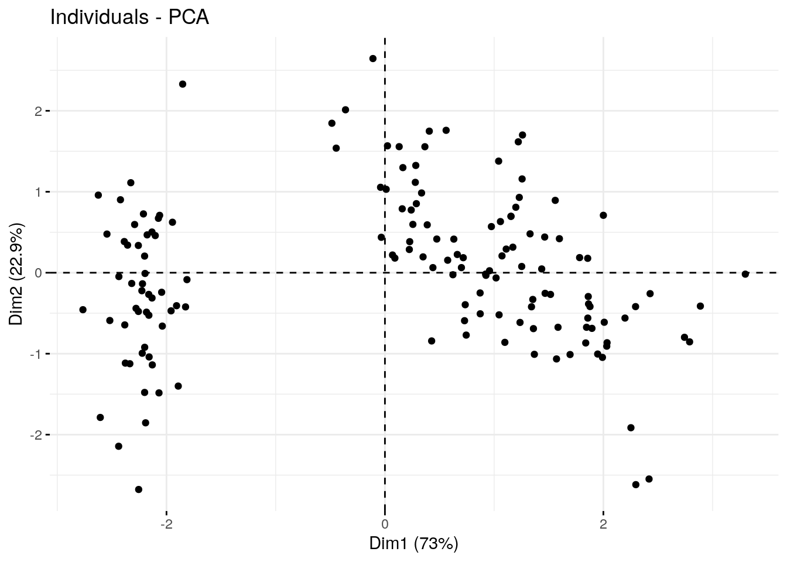
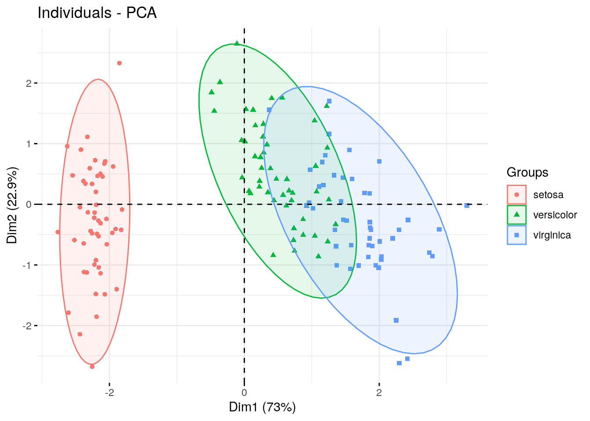

# Principal Components Analysis

## Before You Start

Make sure you can start an RStudio session on AnVIL. Take a look at our guide [here](https://jhudatascience.org/GDSCN_Book_Statistics_for_Genomics_Differential_Expression/getting-set-up.html#introduction).

### Libraries

We will be using the `prcomp()` command which comes loaded into baseR, as well as the [`factoextra` package](https://www.rdocumentation.org/packages/factoextra/versions/1.0.7) for visualization. You can install the `factoextra` package using the install.packages command.


```r
# Install and load factoextra
# AnVIL::install("factoextra")
library(factoextra)
```

## Introduction

Principal components analysis (PCA) is one of the oldest and most commonly used dimensional reduction techniques. PCA is an unsupervised machine learning algorithm that combines correlated dimensions into a single new variable. This new variable represents an axis or line in the dataset that describes the maximum amount of variation and becomes the first principal component (PC). After the first PC is created, the algorithm then identifies a new axis that is orthagonal (statistically independent) to the first PC while also describing the maximum amount of previously undescribed variation. 

This process continues, with each PC capturing a decreasing amount of variation, until the maximum number of PCS is reached (max number of PCs = total number of variables in the original dataset). 

The first PCs will capture most heterogeneity (and thus most of the signal) in our high-dimensional dataset by definition, while the variation in later PCs will mostly represent noise. Thus, we can use the first PCs to both examine structure in our dataset as well as for downstream analyses to reduce computational work and improve the fit of our statistical models.


::: {.dictionary}
GOING DEEPER: The math behind PCA

PCA is a method of matrix factorization. Essentially, the PCA approach allows a researcher to break down (or decompose) a large data matrix into smaller constituent parts (similar to the way we can break the number 30 into the factors 5 and 6). Each smaller matrix can be summarized by a vector, called the eigenvector. This vector can be resized; how much it is resized can be summarized by a number called the eigenvalue. You can also think of the eigenvalue as the variance of the eigenvector. 

For a large matrix (like most biological datasets), there are many possible ways to decompose the matrix. In our example earlier with the number 30 we could choose to start with the number 5 or the number 6. With PCA, We always start with the eigenvector that has the largest possible eigenvalue. This eigenvector is what we call the first PC. What is left of the original data matrix is then decomposed further into smaller and smaller pieces, with each subsequent eigenvector chosen because it has the largest possible eigenvalue.

The PC variables created by this method are a linear combination of the original variables.The commands in this exercise use the Singular Value Decomposition (SVD) algorithm for matrix factorization. SVD breaks a large matrix down into three smaller matrices and works on both non-symmetric and symmetric matrices. 


If you'd like to learn more, check out [Principal component analysis: a review and recent developments](www.ncbi.nlm.nih.gov/pmc/articles/PMC4792409/) or [Understanding Singular Value Decomposition](https://towardsdatascience.com/understanding-singular-value-decomposition-and-its-application-in-data-science-388a54be95d#:~:text=In%20linear%20algebra%2C%20the%20Singular%20Value%20Decomposition%20%28SVD%29,also%20has%20some%20important%20applications%20in%20data%20science).
:::


## Calculating PCs

### Examining the data

There are many packages available for R and RStudio that can perform PCA. These packages will calculate PCA in similar ways, although some of their default parameters (such as how many PCs the algorithm will calculate and store) may be different. Be sure to read the manuals for any package you choose to use.

For this example, we will use the iris dataset that is preloaded into R. The statistician RA Fisher popularized this dataset for statistical work, although the original data was collected by Edgar Anderson. The dataset contains 4 measurements (petal length, petal width, sepal length, and sepal width) for 150 individuals from 3 different iris species.

Let's start by looking at the first few rows of the dataset.


```r
head(iris)
```

```
##   Sepal.Length Sepal.Width Petal.Length Petal.Width Species
## 1          5.1         3.5          1.4         0.2  setosa
## 2          4.9         3.0          1.4         0.2  setosa
## 3          4.7         3.2          1.3         0.2  setosa
## 4          4.6         3.1          1.5         0.2  setosa
## 5          5.0         3.6          1.4         0.2  setosa
## 6          5.4         3.9          1.7         0.4  setosa
```

Each row represents a single individual flower. The first four columns are _active variables_, or the variables we will use for the principal components analysis. The fifth column is the species of each individual ( _Iris setosa_, _Iris virginica_, or _Iris versicolor_). This is a _supplementary variable_, or additional information about each sample that we will not use in the PCA.

### Calculating the PCs

The actual PCA calculation is quite simple. We specify the calculations are only done on the first four columns of the iris dataset, and we are also scaling each variable so the mean is 0 and the standard deviation is 1.


```r
pca.obj <- prcomp(iris[1:4], scale=T)
str(pca.obj)
```

```
## List of 5
##  $ sdev    : num [1:4] 1.708 0.956 0.383 0.144
##  $ rotation: num [1:4, 1:4] 0.521 -0.269 0.58 0.565 -0.377 ...
##   ..- attr(*, "dimnames")=List of 2
##   .. ..$ : chr [1:4] "Sepal.Length" "Sepal.Width" "Petal.Length" "Petal.Width"
##   .. ..$ : chr [1:4] "PC1" "PC2" "PC3" "PC4"
##  $ center  : Named num [1:4] 5.84 3.06 3.76 1.2
##   ..- attr(*, "names")= chr [1:4] "Sepal.Length" "Sepal.Width" "Petal.Length" "Petal.Width"
##  $ scale   : Named num [1:4] 0.828 0.436 1.765 0.762
##   ..- attr(*, "names")= chr [1:4] "Sepal.Length" "Sepal.Width" "Petal.Length" "Petal.Width"
##  $ x       : num [1:150, 1:4] -2.26 -2.07 -2.36 -2.29 -2.38 ...
##   ..- attr(*, "dimnames")=List of 2
##   .. ..$ : NULL
##   .. ..$ : chr [1:4] "PC1" "PC2" "PC3" "PC4"
##  - attr(*, "class")= chr "prcomp"
```

The `prcomp()` command will create a list containing multiple dataframes and vectors: 

  - _sdev_, a vector of the standard deviations for each PC

  - _rotation_, a matrix of the eigenvectors for each variable
  
  - _center_, a vector of the center value for each variable
  
  - _scale_, a vector of the scaling factor for each variable
  
  - _x_, a matrix of the individual PC values for each flower


## Choosing the number of PCs

We have now calculated our PCs. In this dataset, we have a limited number of PCs and could choose to use all of them in downstream analysis, but this becomes impractical with high-dimensional data. The majority of the variation in the dataset will be captured by the first few PCs, so common practice is to identify a cutoff for how much variation a PC must explain in order to be included. If the data have been scaled and centered, it is also common to include only those PCs with an eigenvalue greater than or equal to 1. 

### Examining PCs in table format

Let's take a look at a table of the eigenvalues and variation captured by each PC first. We'll use a command from the `factoextra` package.


```r
get_eigenvalue(pca.obj)
```

```
##       eigenvalue variance.percent cumulative.variance.percent
## Dim.1 2.91849782       72.9624454                    72.96245
## Dim.2 0.91403047       22.8507618                    95.81321
## Dim.3 0.14675688        3.6689219                    99.48213
## Dim.4 0.02071484        0.5178709                   100.00000
```

This table tells us the vast majority of the variation is described by just the first two PCs. 

This information can also be calculated in the sdev vector of the `pca.obj` list. You don't have to use an additional library like `factoextra`. Instead, you can convert the standard deviations to variances.


```r
pca.obj$sdev^2 / sum(pca.obj$sdev^2)
```

```
## [1] 0.729624454 0.228507618 0.036689219 0.005178709
```

### Examining PCs in a scree plot

It may be easier to examine this data visually, which we can do using a scree plot (Jollife 2002, Peres-Neto, Jackson, and Somers 2005).


```r
fviz_eig(pca.obj, addlabels = TRUE)
```



The PCs are on the x-axis, and the y-axis is the percentage of variance explained by each PC. As you can see, the percentage of explained variance drops off dramatically after the first two PCs.

Going forward, we might choose to use these two variables in our analyses.

## Correlation between variables and PCs

At some point, we might be interested in knowing which variables are contributing to each PC. 

### Examining the contribution of each variable to PCs in table format

Let's first look at this in table form. We first extract the results from our PCA output.


```r
var <- get_pca_var(pca.obj)
var
```

```
## Principal Component Analysis Results for variables
##  ===================================================
##   Name       Description                                    
## 1 "$coord"   "Coordinates for the variables"                
## 2 "$cor"     "Correlations between variables and dimensions"
## 3 "$cos2"    "Cos2 for the variables"                       
## 4 "$contrib" "contributions of the variables"
```

The `get_pca_var` creates a list of matrices with useful information about the PCA. For now, we're interested in the contribution matrix.


```r
var$contrib
```

```
##                  Dim.1       Dim.2     Dim.3     Dim.4
## Sepal.Length 27.150969 14.24440565 51.777574  6.827052
## Sepal.Width   7.254804 85.24748749  5.972245  1.525463
## Petal.Length 33.687936  0.05998389  2.019990 64.232089
## Petal.Width  31.906291  0.44812296 40.230191 27.415396
```

This table tells us what percentage of each PC is contributed by each variable. A higher number (or percentage) means a greater contribution by that variable.

### Examining the contribution of each variable to PCs with a correlation circle

We can also visualize this information using a correlation circle.


```r
fviz_pca_var(pca.obj, col.var = "black", repel=T)
```



The size and position of the vectors (arrows) in the correlation circle can tell us quite a lot about the variables.
  
  - Positively correlated variables are grouped together.

  - Negatively correlated variables are positioned on opposite sides of the plot origin (opposed quadrants) .
  
  - Vectors that end close to the circle outline greatly contribute to a given PC.

  - Shorter vectors contribute very little.
  
  - Vectors that are primarily horizontal mostly contribute to the first PC (the x-axis). 

  - Vectors that are more vertical contribute primarily to the second PC (the y-axis).


## Visualizing structure using PCs

Sometimes it is helpful to plot the PC coordinates of the individual samples in order to identify any population structure in the dataset.


```r
fviz_pca_ind(pca.obj, geom.ind = "point", mean.point=F)
```



Here we've created a scatter plot with the first PC (Dim1) on the x-axis and the second PC (Dim2) on the y-axis. We can clearly see the samples split into 2 clusters. It might be interesting see whether these clusters correspond with iris species (remember, we have that information in the fifth column of the iris data table).


```r
fviz_pca_ind(pca.obj, geom.ind = "point", mean.point=F,
             col.ind = iris$Species,
             addEllipses = TRUE,
             legend.title = "Groups"
             )
```



We used the `col.ind` option to color the dots by species and the `addEllipses` option to create an ellipse around the center of each species cluster. 

## Recap


```r
sessionInfo()
```

```
## R version 4.0.2 (2020-06-22)
## Platform: x86_64-pc-linux-gnu (64-bit)
## Running under: Ubuntu 20.04.3 LTS
## 
## Matrix products: default
## BLAS/LAPACK: /usr/lib/x86_64-linux-gnu/openblas-pthread/libopenblasp-r0.3.8.so
## 
## locale:
##  [1] LC_CTYPE=en_US.UTF-8       LC_NUMERIC=C              
##  [3] LC_TIME=en_US.UTF-8        LC_COLLATE=en_US.UTF-8    
##  [5] LC_MONETARY=en_US.UTF-8    LC_MESSAGES=C             
##  [7] LC_PAPER=en_US.UTF-8       LC_NAME=C                 
##  [9] LC_ADDRESS=C               LC_TELEPHONE=C            
## [11] LC_MEASUREMENT=en_US.UTF-8 LC_IDENTIFICATION=C       
## 
## attached base packages:
## [1] stats     graphics  grDevices utils     datasets  methods   base     
## 
## other attached packages:
## [1] factoextra_1.0.7 ggplot2_3.3.2   
## 
## loaded via a namespace (and not attached):
##  [1] tidyselect_1.1.0  xfun_0.26         purrr_0.3.4       haven_2.3.1      
##  [5] carData_3.0-4     colorspace_1.4-1  vctrs_0.3.4       generics_0.0.2   
##  [9] htmltools_0.5.0   yaml_2.2.1        rlang_0.4.10      ggpubr_0.4.0     
## [13] jquerylib_0.1.4   pillar_1.4.6      foreign_0.8-80    glue_1.6.1       
## [17] withr_2.3.0       readxl_1.3.1      lifecycle_1.0.0   stringr_1.4.0    
## [21] munsell_0.5.0     ggsignif_0.6.0    gtable_0.3.0      cellranger_1.1.0 
## [25] zip_2.1.1         evaluate_0.14     labeling_0.3      knitr_1.33       
## [29] rio_0.5.16        forcats_0.5.0     curl_4.3          highr_0.8        
## [33] broom_0.7.1       Rcpp_1.0.8        readr_1.4.0       scales_1.1.1     
## [37] backports_1.1.10  abind_1.4-5       farver_2.0.3      fs_1.5.0         
## [41] ottrpal_0.1.2     hms_0.5.3         digest_0.6.25     stringi_1.5.3    
## [45] openxlsx_4.2.2    bookdown_0.24     rstatix_0.6.0     dplyr_1.0.2      
## [49] ggrepel_0.8.2     grid_4.0.2        tools_4.0.2       magrittr_2.0.2   
## [53] tibble_3.0.3      crayon_1.3.4      tidyr_1.1.2       car_3.0-10       
## [57] pkgconfig_2.0.3   ellipsis_0.3.1    data.table_1.13.0 rmarkdown_2.10   
## [61] R6_2.4.1          compiler_4.0.2
```

